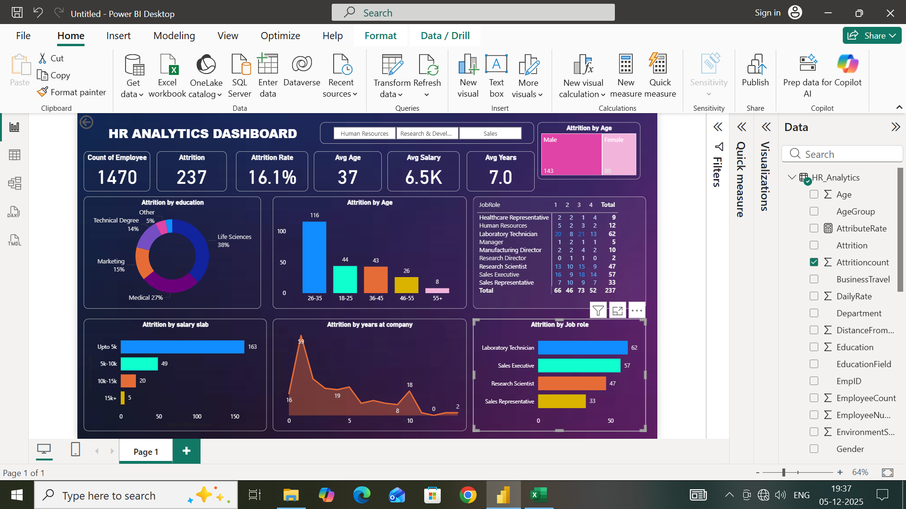

# HR Analytics Dashboard - Power BI

## 📊 Dashboard Preview

##  Overview
This Power BI dashboard analyzes employee attrition trends across departments, age groups, education, and job roles to help HR make data-driven decisions.

##  Key Metrics
- **Total Employees**: 1470
- **Attrition Count**: 237 
- **Attrition Rate**: 16.1%
- **Avg Age**: 37 years
- **Avg Salary**: 6.5K
- **Avg Years at Company**: 7.0

##  Key Insights
1. **Attrition by Age**: Highest in 26-35 age group
2. **Attrition by Education**: Life Sciences (38%) & Medical (27%) fields most affected
3. **Attrition by Job Role**: Laboratory Technician and Sales Executive have highest attrition
4. **Attrition by Salary**: Employees earning 'Upto 5k' show maximum attrition

##  Tools Used
- Power BI Desktop
- DAX for calculated measures

##  Files in Repository
- `Hr-Analytics-dashboard.pbix` - Power BI source file
- `Hr-Analytics-Dashboard.png` - Dashboard screenshot  
- `HR-Analytics-raw-data.csv` - Raw dataset used

##  Connect
Created by Samruddhi Patil
